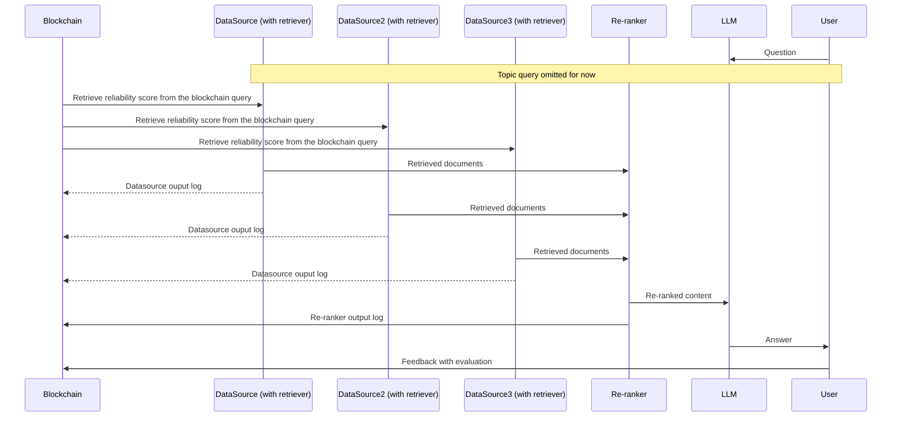

# DRagLog
A basic logging system for drag


# System Workflow


# Data structures 
Reliability Score 
```json
{
    "SourceID": The identifier for the data source,
    "Score": The score for the data source,
    "TimeStamp": The timestamp of the last update
}
```

Data Source Output Log: assuming only one document provided by each Datasource
```json
{
    "Source_ID":  The identifier for the data source,
    "Digest": The digest of the output,
    "TimeStamp": The timestamp of the log
}
```

<!-- Omit for document-level traceback -->
<!-- Re-ranker Output Log
```json
{
    "Input_Source_IDs": The list of input source IDs,
    "Input_Digests": The list of input digests, 
    "Output_Source_IDs": The list of output,
    "Output_Digests": The list of output digests
}
``` -->

LLM Output Log
```json
{
    "LLM_ID": LLM identifier,
    "Input_Digests": The list of input digests,
    "Output_Digest": The digest of output
}
```

On-chain state definition
```json
{
    "State_ID": Datasoruce identifier or composite identifier for logs,
    "Type": Type of the state info,
    "Content": Score/Digest,
    "TimeStamp": The timestamp for the last update,
    "Reserved": Reserved space for other use
}
```

# Todo


