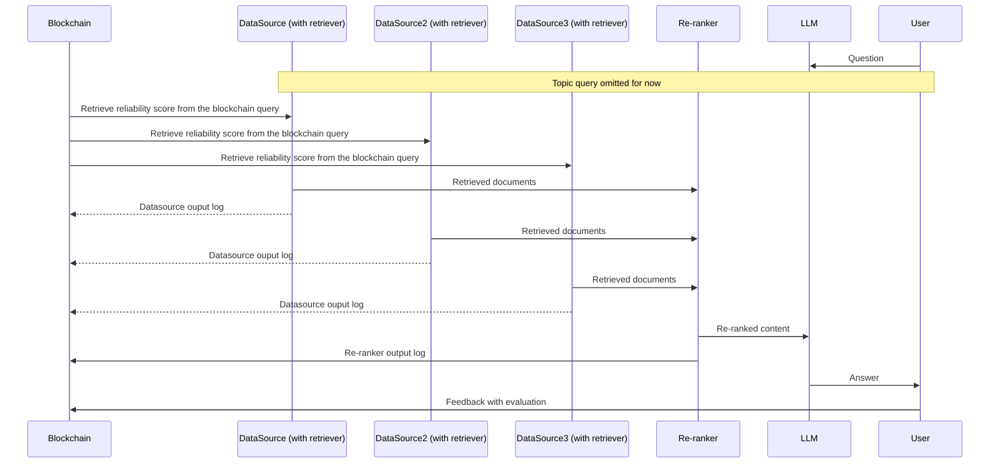

# DRagLog
A basic logging system for drag


# System Workflow


# Data structures 
Reliability Score 
```json
{
    "SourceID": The identifier for the data source,
    "Score": The score for the data source,
    "TimeStamp": The timestamp of the last update
}
```
```json
{
	"LogID": The id of the log,
	"LoggerID": The sender's identifier,  
	"Input": Input digest (list),
	"InputFrom": The source of the input,
	"Output": Output digest,    
	"OutputTo": Receiver's identifier,
	"Timestamp": The timestamp of the log,  
	"Reserved": reserved for future use,
    // "Topic": Topic of the query, for later use
}
```
Data Source Output Log: assuming only one document provided by each Datasource
```json
{
    "LogID": "SourceID-Reranker",
    "LoggerID":  The identifier of the data source,
    "Output": The digest of the document,
    "OutputTo": The identifier of the LLM/Re-ranker,
    "TimeStamp": The timestamp of the log
}
```

<!-- 
Re-ranker Output Log
```json
{
    "Input_Source_IDs": The list of input source IDs,
    "Input_Digests": The list of input digests, 
    "Output_Source_IDs": The list of output,
    "Output_Digests": The list of output digests
}
``` -->

LLM Output Log
```json
{
    "LogID": LLM identifier,
    "Input": The list of input digests,
    "InputFrom": The identifier of the Re-ranker,
    "Output_Digest": The digest of output
}
```

<!-- On-chain state definition
```json
{
    "State_ID": Datasoruce identifier or composite identifier for logs,
    "Type": Type of the state info,
    "Content": Score/Digest,
    "TimeStamp": The timestamp for the last update,
    "Reserved": Reserved space for future use
}
``` -->

# Current assumption
+ One document per source
+ Document-level tracing

# How to make it work
## One command to start it all
Under the root directory of this project, run 
``` make all ```, or
### Blockchain service
Under the root directory of this project, run 
``` make drp_couchdb_deploy ```
### Api Service 
Under the root directory of this project, run 
``` make api_server ```

## In python code
```python
from draglog_client import DragLogClient, LogRecord

# Create client with custom server address
client = DragLogClient("http://your-server:8080")


# 1. Create a log record
log_record = LogRecord(
    logID="test123",
    loggerID="logger1",
    type="log",
    input="test input",
    inputFrom="source1",
    output="test output",
    outputTo="destination1",
    reliabilityScore=-1.0,
    timestamp=datetime.now().isoformat(),
    reserved=""
)
client.create_log_record(log_record)

# 2. Create a reliability record
client.create_reliability_record(
    data_source_id="source1",
    digest="abc123"
)

# 3. Get all log records
all_logs = client.get_all_log_records()
for log in all_logs:
    print(f"Log ID: {log.logID}")
    print(f"Logger ID: {log.loggerID}")
    print(f"Input: {log.input}")
    print(f"Output: {log.output}")
    print("---")

# 4. Get all reliability records
all_reliability = client.get_all_reliability_records()
for record in all_reliability:
    print(f"Data Source ID: {record.logID}")
    print(f"Reliability Score: {record.reliabilityScore}")
    print("---")

# 5. Get a specific log record
log = client.get_log_record("test123")
print(f"Found log record: {log.logID}")

# 6. Get a specific reliability record
reliability = client.get_reliability_record("source1")
print(f"Found reliability record: {reliability.logID}")
print(f"Score: {reliability.reliabilityScore}")

# 7. Update a reliability record's score
client.update_reliability_record(
    data_source_id="source1",
    reliability_score=95.5
)

# 8. Get the modification history for a record
history = client.get_history_for_record("test123")
for entry in history:
    print(f"Timestamp: {entry.timestamp}")
    print(f"Transaction ID: {entry.txID}")
    print(f"Is Delete: {entry.isDelete}")
    if entry.record:
        print(f"Record LogID: {entry.record.logID}")
    print("---")


# 9. Example of querying and updating reliability scores
reliability_records = client.get_all_reliability_records()
for record in reliability_records:
    # Update score based on some condition
    if record.reliabilityScore < 90:
        new_score = min(record.reliabilityScore + 5, 100)
        client.update_reliability_record(
            data_source_id=record.logID,
            reliability_score=new_score
        )

```
